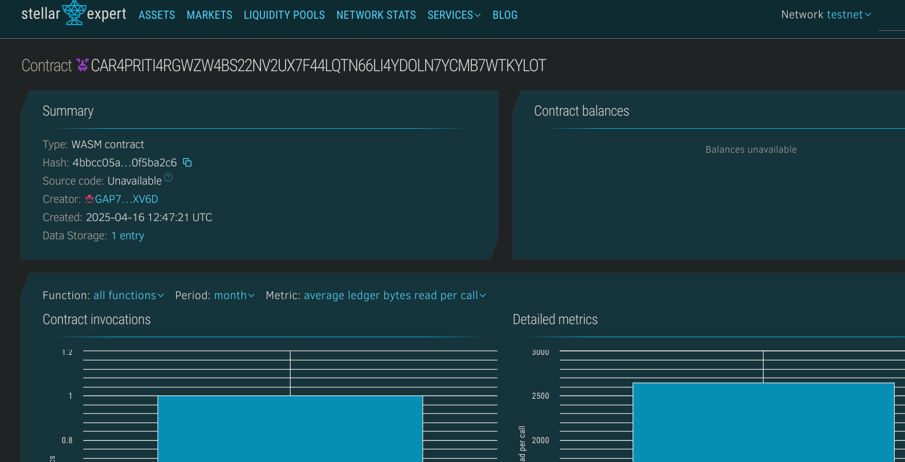

# Online Exam Verifier

## 📌 Project Title
**Online Exam Verifier**

---

## 📄 Project Description
The Online Exam Verifier is a decentralized smart contract that enables educational institutions to verify student participation in online exams. By storing verification records directly on the blockchain, it ensures trust, transparency, and tamper-resistance for exam validation.

---

## 🎯 Project Vision
The vision of this project is to eliminate fraud and manual verification in the online exam ecosystem. Through blockchain's immutable nature, exam records become permanently verifiable and accessible, empowering institutions to validate academic integrity without intermediaries.

---

## 🚀 Key Features
- ✅ Verify student participation in an exam on-chain
- 🔍 Retrieve verification status using student address and exam ID
- 📋 View all verified student-exam records
- ⏳ Timestamp each verification for auditability

---

## 🔮 Future Scope
- 🛂 Add biometric/facial recognition input for enhanced verification
- 🎓 Connect verified records to credential issuing systems (e.g., diplomas)
- 📊 Build dashboards for institutions to view verification statistics
- 🧠 Integrate AI for anomaly detection in verification patterns
- 🌐 Link to IPFS or decentralized storage for exam paper proofs

## Contract Details
CAR4PRITI4RGWZW4BS22NV2UX7F44LQTN66LI4YDOLN7YCMB7WTKYLOT
